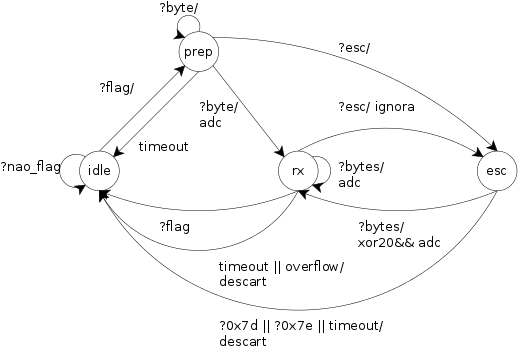

<h1 align='center'>Projeto 2 - Protocolo de enlace</h1>
<p align="center">Projeto de desenvolvimento de um <a href="https://pt.wikipedia.org/wiki/Point-to-Point_Protocol">protocolo de enlace ponto-a-ponto</a></p>

Tabela de conteúdos
=================
<!--ts-->
   * [Protocolo de Enlace](#Protocolo-de-Enlace)
   * [Objetivos](#Objetivos)
   * [Arquitetura do Projeto](#arquitetura-do-projeto)
   * [Pré-requisitos](#Pré-requisitos)
   * [Instruções para Uso](#Instruções-para-Uso)
   * [Autores](#Autores)

## Protocolo de Enlace

O Projeto desenvolvido neste repositório foi baseado no protocolo de enlace ponto-a-ponto (PPP), um protocolo de enlace de dados usado para estabelecer conexão direta ente dois nós. Este protocolo é utilizado na camada física do tipo UART, possuí um encapsulamento de mensagens com até 1024 bytes, garantia de entrega, criptografia de transmissão, controle de acesso ao meio, e estabelecimento de sessão (Este não foi implementado durante o semestre por conta de tempo hábil).

O PPP é usado sobre muitos tipos de redes físicas incluindo cabo serial, linha telefônica, linha tronco, telefone celular, enlaces de rádio especializados e enlaces de fibra ótica como SONET. O PPP também é usado sobre conexões de acesso à Internet. Provedores de serviços de Internet têm usado o PPP para acesso discado à Internet pelos clientes, uma vez que pacotes IP não podem ser transmitidos sobre uma linha de modem por si próprios, sem algum protocolo de enlace de dados.

Existem dois derivdados do PPP, o Point-to-Point Protocol over Ethernet (PPPoE), em português protocolo ponto a ponto sobre Ethernet, e Point-to-Point Protocol over ATM (PPPoA), em português Protocolo ponto a ponto sobre ATM, que são usados mais comumente por Provedores de Serviços de Internet para estabelecer uma conexão de serviços de Internet de Linha Digital de Assinante (ou DSL) com seus clientes.


## Objetivos

Os objetivos deste repositorio foram desenvolver uma aplicação integrada ao protocolo implementado que possibilite o envio e recepção de mensagens via um terminal de texto. Mas que também possa ser utilizado em outras aplicações, assim se apresentando na forma de uma API. Podendo se comunicar biderecionalmente com a implementação de referência.

## Arquitetura do Projeto

O Protocolo desenvolvido pela equipe se comunica atráves de um link utilizando portas seriais, estas sendo emuladas com o [Serialemu](https://github.com/IFSCEngtelecomPTC/Serialemu). O Protocolo é divido em subcamadas: enquadramento, arquitetura, aplicação (também referencia em sala como adaptação). A seguir será explicado a funcionalidade de cada componente do projeto.

### Protocolo

A classe protocolo nada mais é que uma interface da biblioteca do protocolo, podendo instanciar um objeto do tipo Protocolo que faz conexão das subcamadas ao informar a porta serial e o timeout, utilizado para o tratamento de Callbacks.

### Subcamada

A classe subcamada auxilia na conexão das subcamadas mencionadas anteriormente, entre superior e inferior.

### Enquadramento

Este é responsável por delimitar o quadro, utilizando a técnica do tipo sentinela com uma flag de valor `7E` como delimitador do quadro, um byte de escape(esc) `7D` para o prenchimento da mensagem. O transmissor faz o escape dos bytes `7E` e `7D` modificando-os por meio de um XOR `20`



### Arquitetura

Este é conjunto de mecanismos que têm como finalidade garantir a entrega de mensagens, preservando a ordem do envio e buscando eficiência no uso do canal. Possibilitando que o transmissor se certifique de que uma mensagem foi entregue ou não ao destino. Enquanto uma mensagem não tiver sua entrega assegurada, ela permanece na fila de saída mantida no transmissor pelo protocolo. Estes mecanismos sã baseados em:
- Dois tipos de mensagens: DATA e ACK
- Mensagens de confirmação ACK sendo 0 ou 1.
- Mensagens são numeradas de acordo com uma sequência
- Retransmissão de mensagens perdidas ou recusadas


### Aplicação


## Pré-requisitos

Para executar o projeto basta seguir os passos abaixo:

- Clone o repositório do projeto e acesse o diretório:

```bash
$ git clone https://github.com/mmsobral-croom/projeto-2-um-protocolo-de-enlace-arthur-alana-jefferson
```

- Instale o pyserial para rodar o projeto:

```bash
$ pip3 install pyserial
```

## Instruções para Uso

Agora pode rodar o projeto com uma das portas seriais dada pelo serialemu como parâmetro no terminal 1:

```bash
$ python3 test.py [porta_serial_1]
```

Agora pode rodar o projeto de teste implementado pelo professor com uma das portas seriais dada pelo serialemu como parâmetro no terminal 1:

```bash
$ python3 test.py [porta_serial_2] --noSession
```

## Autores

<a href="https://github.com/ArthurAnastopulos">
    <br />
    <sub><b>Arthur Anastopulos dos Santos</b></sub></a><br />

<a href="https://github.com/alanamandim">
    <br />
    <sub><b>Alana Mandim</b></sub></a><br />

<a href="https://github.com/jeffersonbcr">
    <br />
    <sub><b>Jefferson Botitano</b></sub></a>